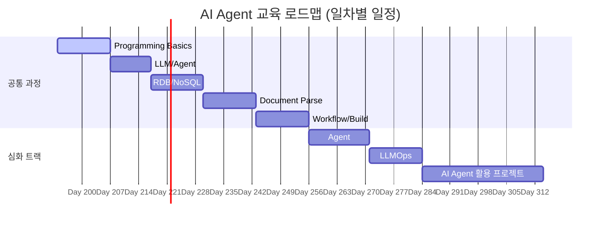

```mermaid
gantt
    title AI Agent 교육 로드맵 (일차별 일정)
    dateFormat  YYYY-MM-DD
    
    %% 축을 일수(Day 01, Day 05...) 형태로 표시하고 5일 단위로 눈금을 끕니다
    axisFormat Day %j
    tickInterval 5d

    section 공통 과정
    Programming Basics     : active, a1, 2026-07-13, 13d
    LLM/Agent              : a2, after a1, 10d
    RDB/NoSQL              : a3, after a2, 13d
    Document Parse         : a4, after a3, 13d
    Workflow/Build         : a5, after a4, 13d

    section 심화 트랙
    Agent                  : b1, after a5, 15d
    LLMOps                 : b2, after b1, 13d
    AI Agent 활용 프로젝트   : b3, after b2, 30d

```
